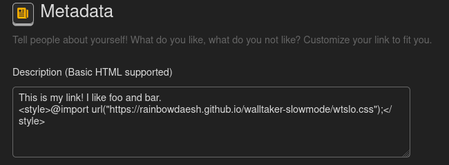

# Slowmode for Walltaker
### Modifies your Walltaker link to have a one minute cooldown between changes.
The link owner still has full permissions.


---
## Installation
1. Edit your link


2. Paste the contents of the html below somewhere into your description
```html
<style>@import url("https://rainbowdaesh.github.io/walltaker-slowmode/wtslo.css");</style>
```



3. Save


If you don't notice changes right away, it could be because of an issue with caching/cookies. Perhaps you can hard refresh your page (`CTRL+F5` or `CMD+SHIFT+R`) or clear your cookies and cache for `joi.how`. You can clear them in your browser's setting tab. Alternatively, you can import the contents of `wtslow.html` instead to instantly make changes to your link, but it may be a bit cluttered in your link description. It also does not automatically update.

---
## License
This project is licensed under the GNU GPL v3. See [LICENSE](LICENSE) for details.
