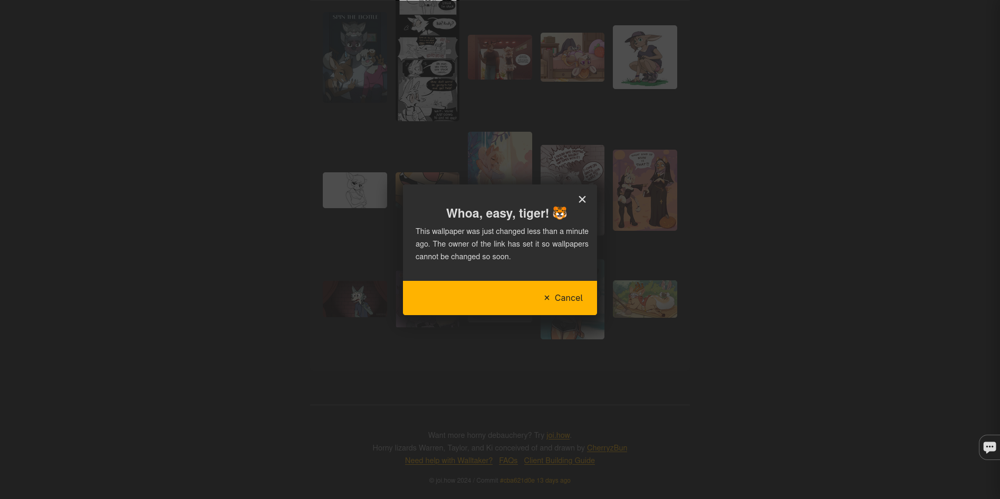
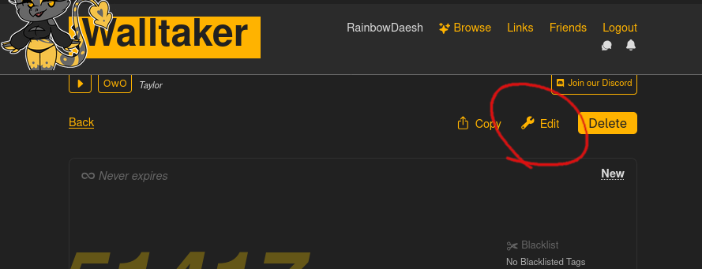
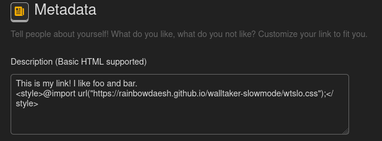
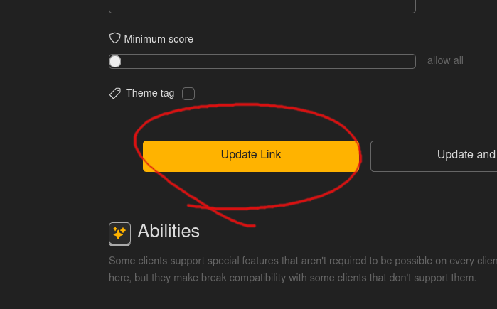

# Slowmode for Walltaker
### Modifies your Walltaker link to have a one minute cooldown between changes.
The link owner still has full permissions.



---
## Installation
1. Edit your link



2. Paste the contents of `wtslo.html` (or the html below) somewhere into your description
```html
<style>.tabs .modal__buttons .secondary{display:none}.tabs .modal h4,.tabs .modal p{visibility:hidden;position:relative}.tabs .modal h4::before,.tabs .modal p::before{content:"Whoa, easy, tiger! 🐯";visibility:visible;position:absolute}.tabs .modal p::before{content:"This wallpaper was just changed less than a minute ago. The owner of the link has set it so wallpapers cannot be changed so soon."}.accent-block~.tabs .modal .secondary{display:block}</style>
```



3. Save



---
## License
This project is licensed under the GNU GPL v3. See [LICENSE](LICENSE) for details.
